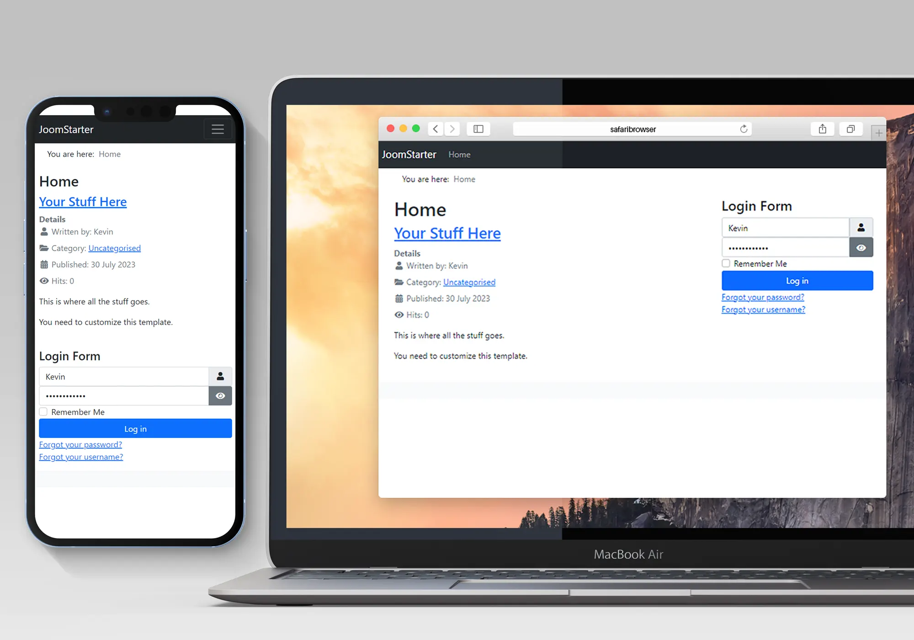

# j4starter

A starter/boilerplate template for Joomla 4 and 5 designed to be easily built upon.

This is a stripped down version of the default Cassiopeia template with extensive comments explaining what nearly every line of code is doing.

You can read the full tutorial on template development at [my website](https://kevinsguides.com/guides/webdev/joomla4/joomla-4-templates/develop-j4-template)

I also have a 4 part YouTube video series on template development you can check out (again links on KevinsGuides.com)

